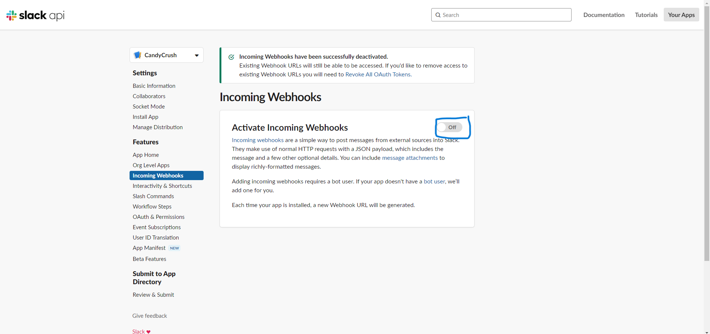

# **End-to-End CI/CD Workflow for a CandyCrush App using GitOps**

Embark on an immersive project centered around the deployment of a CandyCrush App. Utilizing GitHub Actions as our robust CI/CD tool, we aim to seamlessly deploy the application on Amazon ECR and EKS. Additionally, we'll harness the power of ArgoCD to enhance the deployment process.

## **Architecture**


## **Prerequisites**

- [x]  AWS Account created
- [x]  SonarCloud Account configured
- [x]  Terraform, Helm, AWS CLI, Kubectl installed on your local machine
- [x]  Code editor of your choice (VSCode, Sublime, etc.)
- [x]  GitBash installed

# **Let's dive into the project**

## ** Part 1: Clone the code on your machine

```sh
git clone https://github.com/teodor1006/CandyCrush-CICD-GitOps.git
```

## **Part 2: Create an IAM User & Configure AWS CLI**

### **Step 1: Create IAM User**

* Open the AWS Management Console and sign in with your AWS account.

* Navigate to the IAM dashboard.

* In the left sidebar, click on "Users" and then click the "Add user" button.

* Enter a username, check "Programmatic access" for AWS CLI, and click "Next: Permissions."

* Choose "Attach existing policies directly" and select:

```
AdministratorAccess
AmazonEC2ContainerRegistryFullAccess
```

* Review your choices and click "Create user."

* On the user details page, go to the "Security credentials" tab.

* Under the "Access keys" section, click "Create access key."

* Download the CSV file containing the access key ID and secret access key. Keep this file secure as it will not be accessible again.

### **Step 2: Configure AWS CLI**

* Open a terminal or command prompt (In my case gitbash).

* Run the following command:

```sh
aws configure
```

* Enter the IAM user's access key ID & secret access key from the stored CSV File, default region and output format when prompted.

```sh
AWS Access Key ID [None]: <YOUR_ACCESS_KEY_ID>
AWS Secret Access Key [None]: <YOUR_SECRET_ACCESS_KEY>
Default region name [None]: us-east-1
Default output format [None]: json
```

* AWS CLI is now configured with the IAM user credentials.

## **Part 3: Setting up SonarCloud for Code Quality Analysis**

### **Step 1: Configure SonarCloud**

* First go to http://sonarcloud.io/ and click on connect with GitHub.
* After signing in to SonarCloud, create a new organization that will hold your projects.


* In SonarCloud, go to your Account Settings -> Security and generate a new token. This token will be used to authenticate SonarCloud with your GitHub repository.
* Go to your GitHub repository. Navigate to "Settings" > "Secrets". Add a new secret with the name SONAR_TOKEN and paste the token generated in the previous step.


* Add a sonar-project.properties file to the root of your project. Configure this file with the necessary settings, such as the project key, organization key, and source directory. Example:

```sh
sonar.organization=<your-sonarcloud-organization>
sonar.projectKey=<your-project-key>
```

### **Step 2: Create GitHub Token for SonarCloud**

* Go to your GitHub account.
* Click on your profile picture in the top-right corner and select "Settings."
* In the left sidebar, click on "Developer settings."
* In the Developer settings, click on "Personal access tokens" under "Access tokens."
* Click the "Generate token" button.
* Once generated, copy the token immediately. GitHub will only show it once for security reasons.
* After that store the token in your GitHub repository with the name GIT_TOKEN.

## **Part 4: Integrating Slack for Notifications**

### **Step 1: Set Up a Slack Workspace and Obtain a Webhook URL**

* Go to the https://api.slack.com/apps page and create a new app for your workspace.
* After creating the app, enable "Incoming Webhooks" in the "Features" section.



* Scroll down to the "Incoming Webhooks" section and click on "Add New Webhook to Workspace." Choose the channel where you want notifications to be sent.
* Once added, copy the generated Webhook URL. This URL will be used to send notifications to your Slack channel.


### **Step 2: Add Slack Webhook URL as a Secret in GitHub**

* Go to "Settings" > "Secrets" in your repository.
* Click on "New repository secret."
* Name the secret SLACK_WEBHOOK_URL and paste the Webhook URL you obtained from Slack.

## **Part 5: Integrating AWS Credentials**

* Go to "Settings" > "Secrets" in your repository.
* Click on "New repository secret."
* Add the following AWS credentials as secrets:

```sh
AWS_ACCESS_KEY_ID
AWS_SECRET_ACCESS_KEY
REGISTRY
```


* Before starting creating the workflow make sure that you go to your github repo -> Settings -> Actions -> General -> Workflow permissions -> Click on Read and write permissions


## **Part 6: Create S3 Bucket and ECR Repository**

### **Step 1: Create an S3 Bucket**

* In the AWS Management Console, search for `S3` in the Find Services search bar.
* Click the "Create bucket" button.
* Enter a globally unique name for your bucket in the "Bucket name" field (e.g., candycrush-terrastate).
* Keep the rest as default -> Click "Create bucket".

### **Step 2: Create an ECR Repository**

* In the AWS Management Console, search for "ECR" under "Containers" in the Find Services search bar.
* In the Amazon ECR console, click the "Get Started" button -> Click "Create repository".
* Enter a name for your repository in the "Repository name" field (e.g., candycrush).
* Click "Create repository".

## **Part 7: Provision an EKS Cluster with Terraform**

* Open the the `EKS-Terraform` folder in your terminal and put the following commands:

```sh
terraform init
terraform fmt -check
terraform validate
terraform plan -out planfile
terraform apply -auto-approve -input=false -parallelism=1 planfile
```
* Wait about 10 minutes for starting the cluster.

## **Part 8: Define and run the complete workflow**

```sh
name: Candycrush CICD

on: workflow_dispatch
env:
  AWS_REGION: us-east-1
  ECR_REPOSITORY: candycrush
  
jobs:
  Analysis-Dependencies:
    runs-on: ubuntu-latest
    steps:
      - uses: actions/checkout@v3
        with:
          fetch-depth: 0  
      - name: SonarCloud Scan
        uses: SonarSource/sonarcloud-github-action@master
        env:
          GITHUB_TOKEN: ${{ secrets.GIT_TOKEN }}  
          SONAR_TOKEN: ${{ secrets.SONAR_TOKEN }} 

      - name: NPM Install
        run: npm install

  BUILD_AND_PUBLISH:
    needs: Analysis-Dependencies
    runs-on: ubuntu-latest
    steps:
      - name: Code checkout
        uses: actions/checkout@v4

      - name: Build & Upload Image to ECR
        uses: appleboy/docker-ecr-action@master
        with:
         access_key: ${{ secrets.AWS_ACCESS_KEY_ID }}
         secret_key: ${{ secrets.AWS_SECRET_ACCESS_KEY }}
         registry: ${{ secrets.REGISTRY }}
         repo: ${{ env.ECR_REPOSITORY }}
         region: ${{ env.AWS_REGION }}
         tags: latest,${{ github.run_number }}
         daemon_off: false
         dockerfile: ./Dockerfile
         context: ./ 

  TRIVY_SCAN:
    needs: BUILD_AND_PUBLISH
    runs-on: ubuntu-latest
    steps:
      - name: Code checkout
        uses: actions/checkout@v4

      - name: Run Trivy vulnerability scanner
        uses: aquasecurity/trivy-action@master
        with: 
          image-ref: '${{ secrets.REGISTRY }}/${{ env.ECR_REPOSITORY }}:${{ github.run_number }}'
          format: 'sarif'
          output: 'trivy-results.sarif' 
        env:
          AWS_ACCESS_KEY_ID: ${{ secrets.AWS_ACCESS_KEY_ID }}
          AWS_SECRET_ACCESS_KEY: ${{ secrets.AWS_SECRET_ACCESS_KEY }}
          AWS_DEFAULT_REGION: ${{ env.AWS_REGION }}

      - name: Upload Trivy scan results to GitHub Security tab
        uses: github/codeql-action/upload-sarif@v2
        with:
          sarif_file: 'trivy-results.sarif'

  DeployToEKS:
    needs: [BUILD_AND_PUBLISH, TRIVY_SCAN]
    runs-on: ubuntu-latest
    steps:
      - name: Code checkout
        uses: actions/checkout@v4

      - name: Install kubectl
        uses: azure/setup-kubectl@v2.0
        with:
          version: 'v1.27.0' # default is latest stable
        id: install  

      - name: Configure AWS credentials
        uses: aws-actions/configure-aws-credentials@v1
        with:
          aws-access-key-id: ${{ secrets.AWS_ACCESS_KEY_ID }}
          aws-secret-access-key: ${{ secrets.AWS_SECRET_ACCESS_KEY }}
          aws-region: ${{ env.AWS_REGION }}

      - name: Login to Amazon ECR
        id: login-ecr
        uses: aws-actions/amazon-ecr-login@v1

      - name: Update kube config
        run: aws eks update-kubeconfig --name candycrush-cluster --region us-east-1
    
      - name: Deploy to EKS
        run: |
          kubectl apply -f manifests/deployment.yaml
          kubectl apply -f manifests/service.yaml 

      - name: Send a Slack Notification
        if: always()
        uses: act10ns/slack@v2
        with:
          status: ${{ job.status }}
          steps: ${{ toJson(steps) }}
          channel: '#githubactions-cicd'
        env:
          SLACK_WEBHOOK_URL: ${{ secrets.SLACK_WEBHOOK_URL }}
```

* We are going to trigger the workflow manually (You can change that if you want the workflow to be triggered when there is a change in the code just replace `workflow_dispatch` with the comment `[push, workflow_dispatch]`).

* Go to your github repo and click on Actions. Click on your workflow and on the right side click on `Run workflow`.


* You should get a notification from Slack.


* Go to your SonarCloud Account and take a look at your project for potential bugs, code smells, etc.


* Open the Security Tab in your github repo and see the trivy image scan.


* Go to your ECR Repo and taka a look at your uploaded Image.


## **Part 9: Access the Web Application**

* Open your AWS Management Console -> EC2 -> Load Balancers
* Click on it, copy the DNS name and paste it in your browser.


## **Part 10: ArgoCD Setup**

* Before starting configuring ArgoCD, open your PowerShell as Administrator and install the following:

```sh
choco install jq
```

* Open your GitBash terminal and provide the following command:

```sh
aws eks update-kubeconfig --name <cluster-name> --region <cluster-region>
```
* Check for nodes and pods
```sh
kubectl get nodes
```
### **Let's begin with the installation of ArgoCD**

* You can also follow this link: `https://archive.eksworkshop.com/intermediate/290_argocd/`

```sh
kubectl create namespace argocd 
kubectl apply -n argocd -f https://raw.githubusercontent.com/argoproj/argo-cd/v2.4.7/manifests/install.yaml
```

* By default, `argocd-server` is not publicly exposed. For this project, we will use a Load Balancer to make it usable:

```sh
kubectl patch svc argocd-server -n argocd -p '{"spec": {"type": "LoadBalancer"}}'
```
* Wait about 2 minutes for the LoadBalancer creation.

```sh
export ARGOCD_SERVER=`kubectl get svc argocd-server -n argocd -o json | jq --raw-output '.status.loadBalancer.ingress[0].hostname'`
```
->> This command exports the ArgoCD server's load balancer hostname, saving it in the ARGOCD_SERVER variable. You can use this variable in other commands or scripts to access the ArgoCD web UI or interact with the server programmatically.

* Get the Load Balancer external IP

```sh
echo $ARGOCD_SERVER
```


* Copy the link and paste it into your browser:


* To use ArgoCD interface, we need to enter our credentials. The default username is "admin" so we can enter it immediately, but we will need to get the initial password from ArgoCD.

```sh
export ARGO_PWD=`kubectl -n argocd get secret argocd-initial-admin-secret -o jsonpath="{.data.password}" | base64 -d`
echo $ARGO_PWD
```


* Paste the following in Gitbash and make sure to replace the repoURL with yours:

```sh
kubectl apply -f application.yaml
```

* After that you can check the status of the App.


* Click on `candycrush-service` -> Details -> Copy the `Hostnames` section and paste it in your browser.


## **Part 11: Clean Up**

* Open your `EKS-Terraform` folder and type:

```sh
terraform destroy -auto-approve
```
* After the terraform files got deleted, delete also your ECR Repo and S3 Bucket.


 


